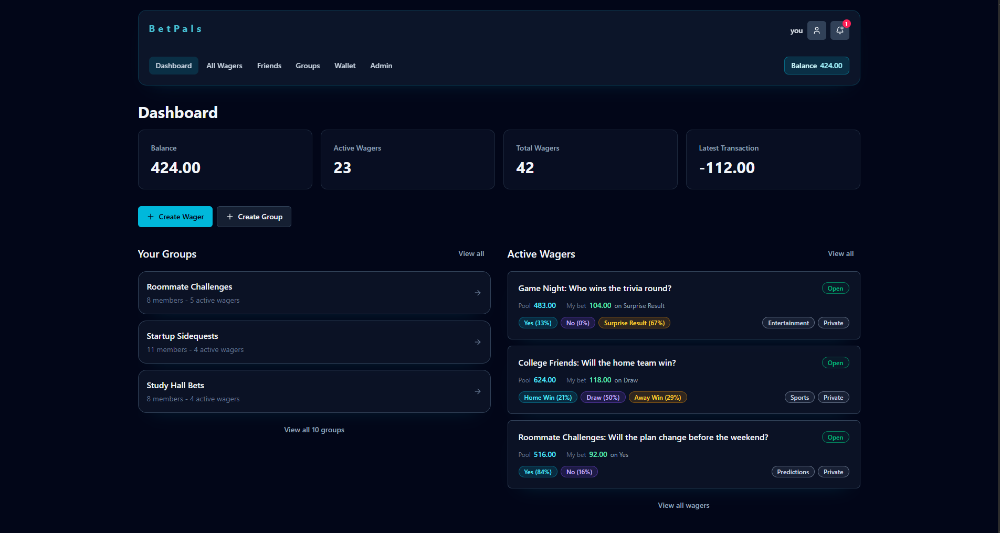
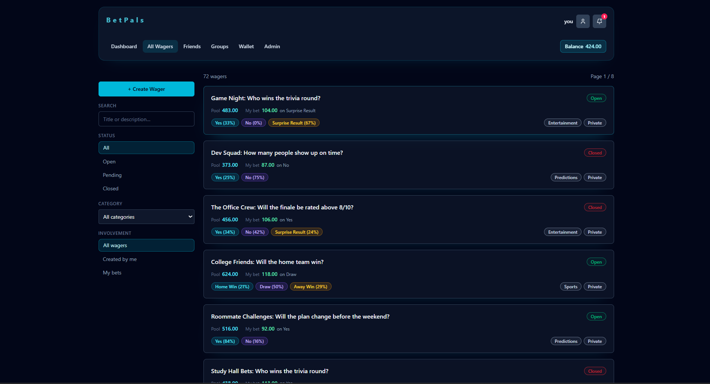
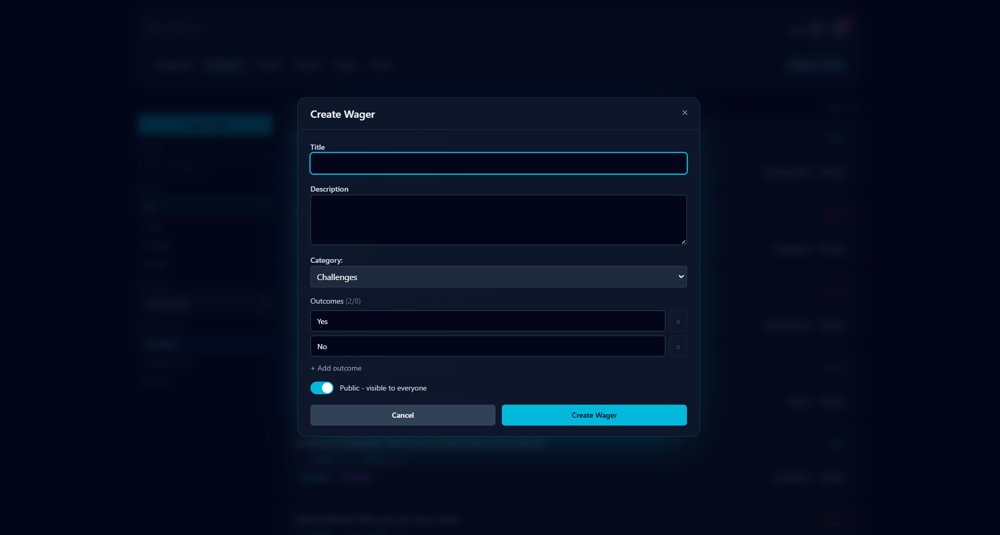
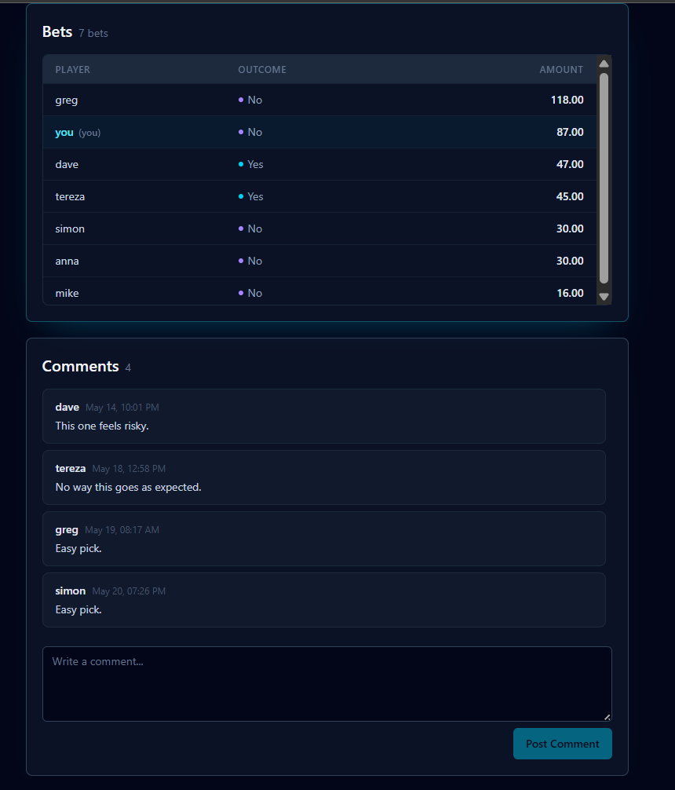
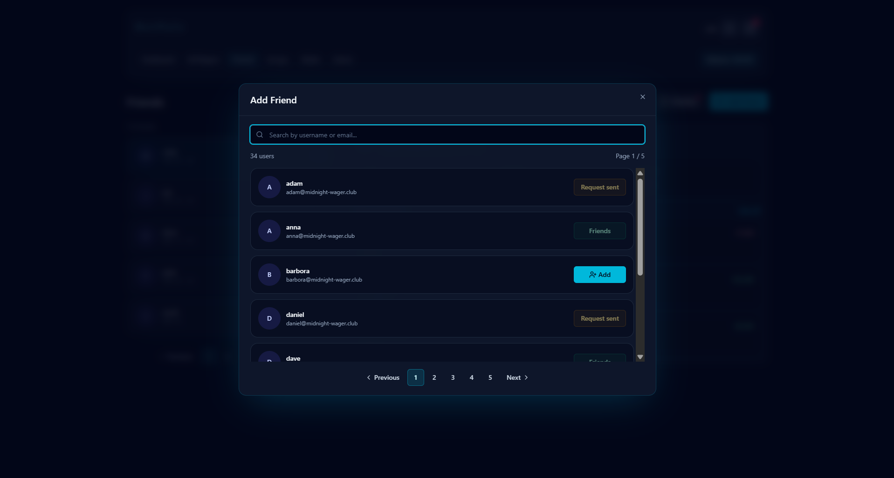
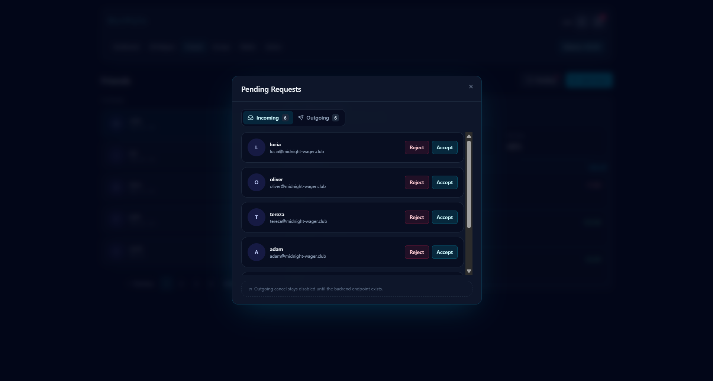
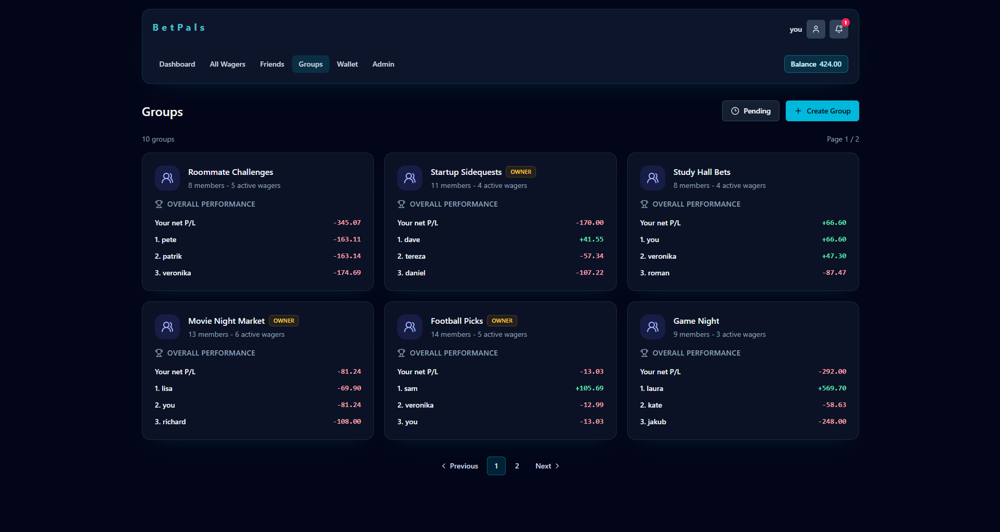
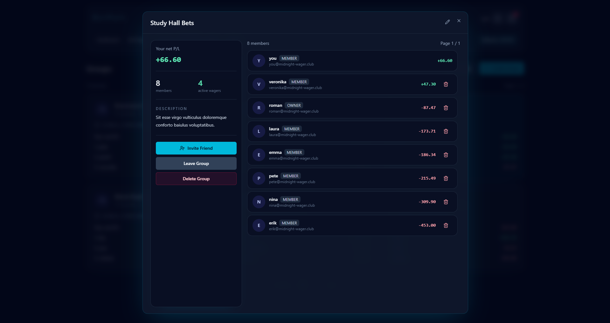
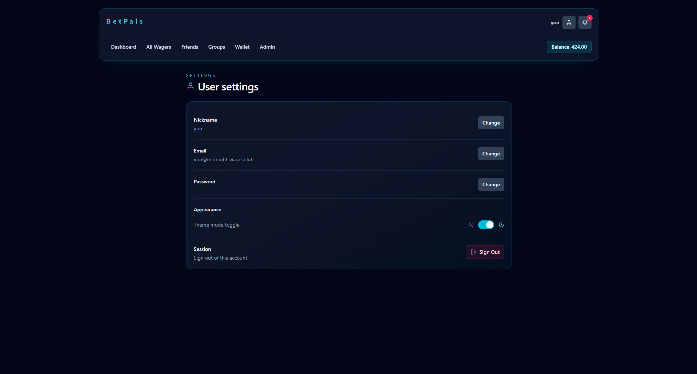

# Friends-Bets

Friends-Bets is a full-stack web application for managing social wagers: create wagers, place bets, view live pools/odds, manage wallet balance, follow friends and groups, and receive in-app notifications. It is organized as a multi-package workspace with a clear client/server separation and shared type/schema definitions.
# UI Screenshots
<table>
  <tr>
    <td>
      <a href="./docs/screenshots/dashboard.png">
        
      </a>
    </td>
    <td>
      <a href="./docs/screenshots/all_wagers.png">
        
      </a>
    </td>
  </tr>
  <tr>
    <td align="center"><strong>Dashboard</strong></td>
    <td align="center"><strong>Wagers</strong></td>
  </tr>
  <tr>
    <td>
      <a href="./docs/screenshots/create_wager.png">
        
      </a>
    </td>
    <td>
      <a href="./docs/screenshots/wager_detail.png">
        
      </a>
    </td>
  </tr>
  <tr>
    <td align="center"><strong>Create Wager</strong></td>
    <td align="center"><strong>Wager Detail</strong></td>
  </tr>
  <tr>
    <td>
      <a href="./docs/screenshots/wager_detail_2.png">
        
      </a>
    </td>
    <td>
      <a href="./docs/screenshots/friends.png">
        
      </a>
    </td>
  </tr>
  <tr>
    <td align="center"><strong>Wager Detail Participants</strong></td>
    <td align="center"><strong>Friends</strong></td>
  </tr>
  <tr>
    <td>
      <a href="./docs/screenshots/add_friend.png">
        
      </a>
    </td>
    <td>
      <a href="./docs/screenshots/pending_requests.png">
        
      </a>
    </td>
  </tr>
  <tr>
    <td align="center"><strong>Add Friend</strong></td>
    <td align="center"><strong>Pending Requests</strong></td>
  </tr>
  <tr>
    <td>
      <a href="./docs/screenshots/groups.png">
        
      </a>
    </td>
    <td>
      <a href="./docs/screenshots/group_detail.png">
        
      </a>
    </td>
  </tr>
  <tr>
    <td align="center"><strong>Groups</strong></td>
    <td align="center"><strong>Group Detail</strong></td>
  </tr>
  <tr>
    <td>
      <a href="./docs/screenshots/wallet.png">
        
      </a>
    </td>
    <td>
      <a href="./docs/screenshots/admin.png">
        
      </a>
    </td>
  </tr>
  <tr>
    <td align="center"><strong>Wallet</strong></td>
    <td align="center"><strong>Admin</strong></td>
  </tr>
  <tr>
    <td>
      <a href="./docs/screenshots/user_settings.png">
        
      </a>
    </td>
    <td></td>
  </tr>
  <tr>
    <td align="center"><strong>User Settings</strong></td>
    <td></td>
  </tr>
</table>

**Implemented features**
- Wager lifecycle: create wagers, list, view details, resolve wagers and trigger payouts
- Betting: place single bet per user per wager; odds and pools derived from current bets
- Wallet: deposit/withdraw endpoints, balance overview and paginated transaction history
- Friends: send/accept friendship relationships; view friend-specific wagers
- Groups: group membership and group-scoped wagers
- Notifications: in-app notifications for wager events and system messages
- Auth & restrictions: verified users and suspension checks gate wallet and betting actions

# Creators:
- Štefan Šutý
- Richard Čech
- Nina Prachárová
- Vladimír Borek

## Architecture
The project is built as a modern TypeScript-first monolithic application with a React frontend, REST API backend, PostgreSQL database, role-based access control. It focuses on clean architecture, maintainability, and production-ready development practices.

# Tech Stack
## Frontend
- React
- TypeScript
- TanStack Router
- Tailwind CSS
- Vite

## Backend
- Node.js
- TypeScript
- Express-style REST API
- PostgreSQL
- Drizzle ORM
- Docker
- Authentication and authorization services
- 

- Monorepo workspace: `client`, `server`, `shared`, and `tests` packages (workspace roots in `package.json`).
- Client: React + Vite front-end using TanStack Router and React Query; generates API hooks from the server OpenAPI spec.
- Server: Elysia HTTP server using Drizzle ORM against PostgreSQL; routes are implemented under `server/src/routes` and rely on service layers under `server/src/services`.
- Shared: Zod schemas and TypeScript types shared between client and server live in `shared/src/schemas` and are consumed by both sides for runtime validation and type-safety.

Repository → Service pattern:
- Routes in `server/src/routes/*` handle HTTP concerns and request/response validation (Zod).
- Business logic lives in `server/src/services/*` (transactional operations, domain rules).
- Persistence-layer code (Drizzle schema and queries) lives under `server/src/db` and `server/src/repositories` (where present). Services call repositories/DB functions — services do not implement raw SQL directly.

Separation of concerns:
- UI and UX live entirely in `client/src`.
- Request validation and serialization follow `shared` Zod schemas.
- Background logic (notifications, wager resolution, payouts) is implemented in server service modules and invoked from route handlers.

## Repository layout (important folders)
- `client/` — React application, routes, features and generated API client.
- `server/` — Elysia server, Drizzle migrations, services, repositories and routes.
- `shared/` — Zod schemas and small utilities used by both client and server.
- `drizzle/` — SQL migration snapshots used by Drizzle kit.
- `docker-compose.yml`, `Dockerfile.dev` — local Docker composition for dev and setup flows.

## Setup & development

### Prerequisites
- Node.js 18+
- npm
- Docker

Environment
- Copy or create a `.env` file at repository root. `.env.example` is used by the legacy setup script if no `.env` exists.

One-command setup (Docker-based)

```bash
npm run setup
```

What `npm run setup` does (current behavior)
- Runs `docker compose --profile setup run --rm setup` which executes the `setup` service defined in `docker-compose.yml`.
- The `setup` service waits for migrations to complete and then runs (in order): database seed, API client generation, router generation and a lint pass. It expects Docker to be available.

Legacy setup (non-docker helper)
- `npm run setup:legacy` runs `scripts/setup.ts`. That script will attempt to create/start a container named `pb138` directly (uses `docker run`), create `.env` from `.env.example` if missing, then run migrations/seeds locally.

Running locally (without Docker compose orchestration)
- Start the server (local):

```bash
npm run server:local
```

- Start the client (local):

```bash
npm run client:local
```

Docker-based development
- Launch both client and server with Docker compose:

```bash
npm run dev
```

Start only server or client (Docker):

```bash
npm run server   # starts the server container
npm run client   # starts the client container
```

Database migrations & seeds
- Generate drizzle artifacts: `npm run db:generate` (root delegates to server workspace)
- Apply migrations:
	- Docker/migrate service: `npm run db:migrate` (root delegates to `docker compose run --rm migrate`)
	- Local: `npm run db:migrate:local` (runs inside `@pb138/server`)
- Seed: `npm run db:seed` (root delegates to server workspace via tools profile)

Linting & tests
- Lint (root): `npm run lint` — runs linting inside the workspace via the tools profile.
- Tests (root): `npm run test` — runs test suite inside the tools profile.
- Local test run: `npm run test:local` to run tests in `@pb138/tests` package.

## Testing

- Tests are implemented with Vitest. Server and client packages each have their own `test` scripts (`vitest run`).
- Run tests via the root workspace helpers (`npm run test`) or run package-specific tests with `npm run test -w @pb138/client` or `-w @pb138/server`.

## Key commands (quick reference)
- `npm run setup` — Docker-based project setup (recommended)
- `npm run dev` — bring up client + server in Docker
- `npm run server` / `npm run client` — start server or client containers
- `npm run docker:down` — stop compose services
- `npm run docker:reset` — stop compose and remove volumes (clean DB)
- `npm run db:migrate` / `npm run db:seed` — manage DB migrations and seed
- `npm run lint` / `npm run test` — QA tools

## Code organization & conventions

- `client/src/features/*` contains feature folders (wagers, friends, groups, notifications, wallet) with components, hooks and API hooks.
- `client/src/api/*` has thin network helpers and generated API clients.
- `server/src/routes/*` are HTTP route modules that validate and forward to service functions.
- `server/src/services/*` implement domain logic and coordinate repository/DB calls.
- `server/src/db` and `drizzle/` contain Drizzle schema and SQL migration snapshots.
- `shared/src/schemas` contains Zod schemas and response/request shapes used to keep client/server contracts in sync.

Design rules
- Keep business logic in `server/src/services/*` and persist/retrieve via `server/src/db` or `repositories` helpers.
- Route handlers should be thin: validate → call service → return typed response using `shared` schemas.
