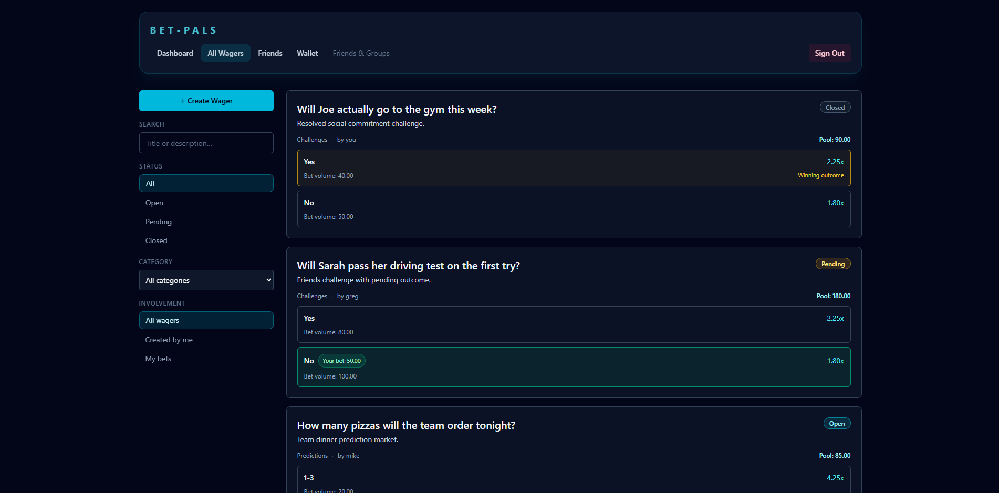
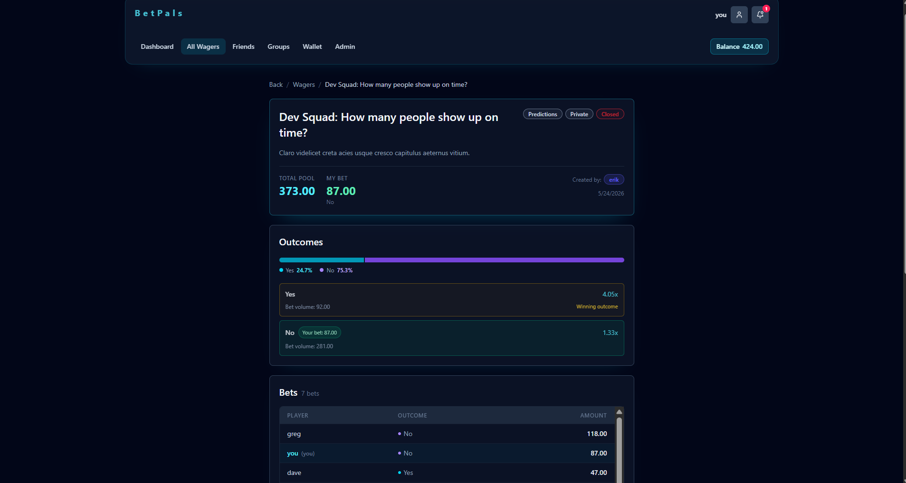
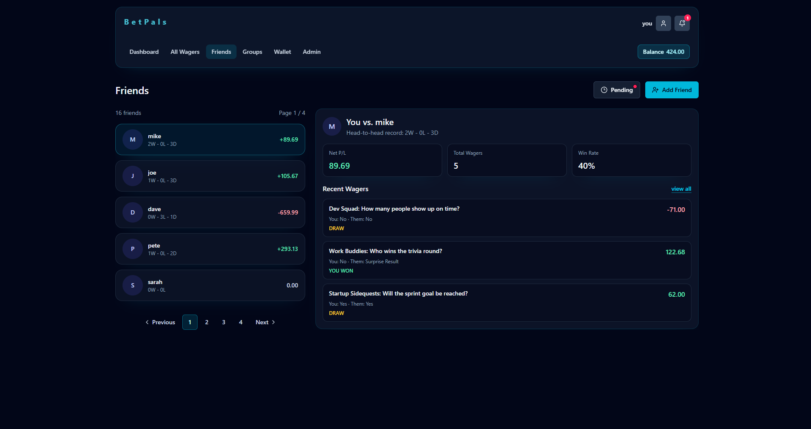
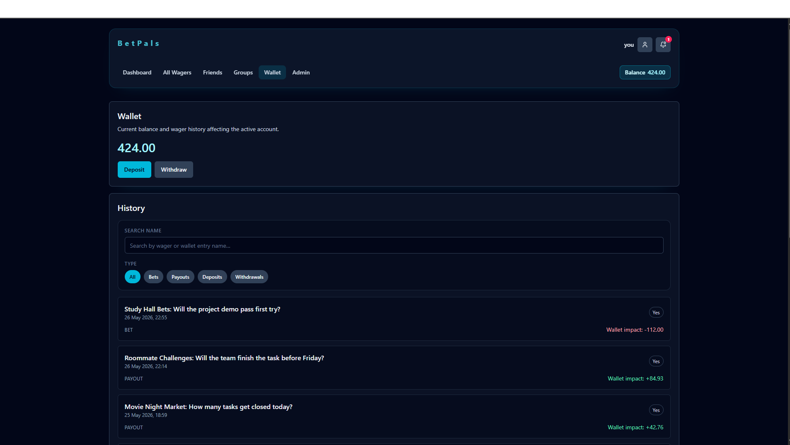
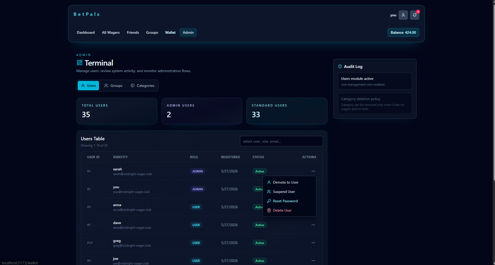

# Friends-Bets
## Team project

Friends-Bets is a full-stack web application for creating private betting groups with friends. Users can create wagers, invite friends, place bets, track outcomes, and manage wallet balances inside closed social groups.

The project is built as a modern TypeScript-first monolithic application with a React frontend, REST API backend, PostgreSQL database, role-based access control, and CI/CD support. It focuses on clean architecture, type safety, maintainability, and production-ready development practices.

# UI Screenshots
<table>
  <tr>
    <td>
      <a href="./docs/screenshots/wagers.png">
        
      </a>
    </td>
    <td>
      <a href="./docs/screenshots/wager_detail.png">
        
      </a>
    </td>
  </tr>
  <tr>
    <td align="center"><strong>Wagers</strong></td>
    <td align="center"><strong>Wager Detail</strong></td>
  </tr>
  <tr>
    <td>
      <a href="./docs/screenshots/friends.png">
        
      </a>
    </td>
    <td>
      <a href="./docs/screenshots/wallet.png">
        
      </a>
    </td>
  </tr>
  <tr>
    <td align="center"><strong>Friends</strong></td>
    <td align="center"><strong>Wallet</strong></td>
  </tr>
  <tr>
    <td>
      <a href="./docs/screenshots/admin.png">
        
      </a>
    </td>
    <td></td>
  </tr>
  <tr>
    <td align="center"><strong>Admin</strong></td>
    <td></td>
  </tr>
</table>


# Tech Stack
## Frontend
- React
- TypeScript
- TanStack Router
- Tailwind CSS
- Vite

## Backend
- Node.js
- TypeScript
- Express-style REST API
- PostgreSQL
- Drizzle ORM
- Docker
- Authentication and authorization services


Clean client-server split with dedicated packages:
- `client` (React + Vite + generated API hooks)
- `server` (Elysia + Drizzle + PostgreSQL)
- `shared` (shared Zod schemas)
- root package (orchestration scripts only)

## Quick Start

### Prerequisites
- Node.js 18+
- npm
- Bun (optional, preferred if installed)
- Docker

### One-command setup

```bash
npm run setup
```

This command:
1. Creates/starts PostgreSQL Docker container `pb138`
2. Installs dependencies in `server` and `client`
3. Runs DB generate/migrate/seed
4. Generates client API from OpenAPI
5. Runs lint

If Docker is unavailable or any Docker command fails, setup exits immediately with a non-zero status.

### Start API

```bash
npm run server
```

Server URLs:
- API: `http://localhost:3000`
- Swagger: `http://localhost:3000/swagger`

### Start frontend

```bash
npm run client
```

Frontend URL:
- App: `http://localhost:5173`

## Scripts (root)

- `npm run setup` - full setup pipeline (uses `bun` where available, falls back to `npm`)
- `npm run server` - start server package
- `npm run client` - start client package
- `npm run build` - build client + server typecheck
- `npm run lint` - lint client + server + root scripts
- `npm run api:generate` - generate `client/src/api/gen`
- `npm run db:generate` - generate drizzle migration
- `npm run db:migrate` - apply migrations
- `npm run db:seed` - seed sample data
- `npm run cli:query` - run query report

## Debugging

### Query summary

```bash
npm run cli:query
```

Shows open wagers, recent bets, and accurate totals.

### Health check

```bash
curl http://localhost:3000/api/health
```

Expected response:

```json
{"status":"ok","service":"pb138-api"}
```

## Notes

- Client and server are separate packages with separate dependency trees.
- Root package is intentionally thin and only orchestrates workflows.
- Shared schemas are in `shared/src/schemas` and imported by both sides.
- Authenticated users now have a Wallet tab that shows current balance plus wager-related transaction history.
- Bets are limited to one per user per wager, and suspended users cannot place bets or create wagers.
- Create Wager and wager resolution both use the authenticated user on the backend; the UI no longer asks for manual user IDs.
- Wager cards and detail pages show live pool totals and odds derived from current bet totals.
- The wager detail page includes a temporary resolve shortcut so any authenticated user can close an open wager and trigger payouts.

## Seeded Test Users

The development seed creates a set of test users with predictable passwords so contributors can sign in quickly. Run `npm run db:seed` (or `npm run setup`) to apply the seed.

Default passwords:
- Admins: `AdminPass123!`
- Users: `UserPass123!`

Seeded accounts (email : password):
- you@midnight-wager.club : AdminPass123! (admin)
- sarah@midnight-wager.club : AdminPass123! (admin)
- mike@midnight-wager.club : UserPass123!
- joe@midnight-wager.club : UserPass123!
- dave@midnight-wager.club : UserPass123!
- pete@midnight-wager.club : UserPass123!
- lisa@midnight-wager.club : UserPass123!
- tom@midnight-wager.club : UserPass123!
- anna@midnight-wager.club : UserPass123!
- greg@midnight-wager.club : UserPass123!
- kate@midnight-wager.club : UserPass123!
- sam@midnight-wager.club : UserPass123!
- richard@midnight-wager.club : UserPass123!

Notes:
- These passwords are for development and testing only. Do not use them in production.
- The seed logs the same credentials to the console when run, so you can verify them.
